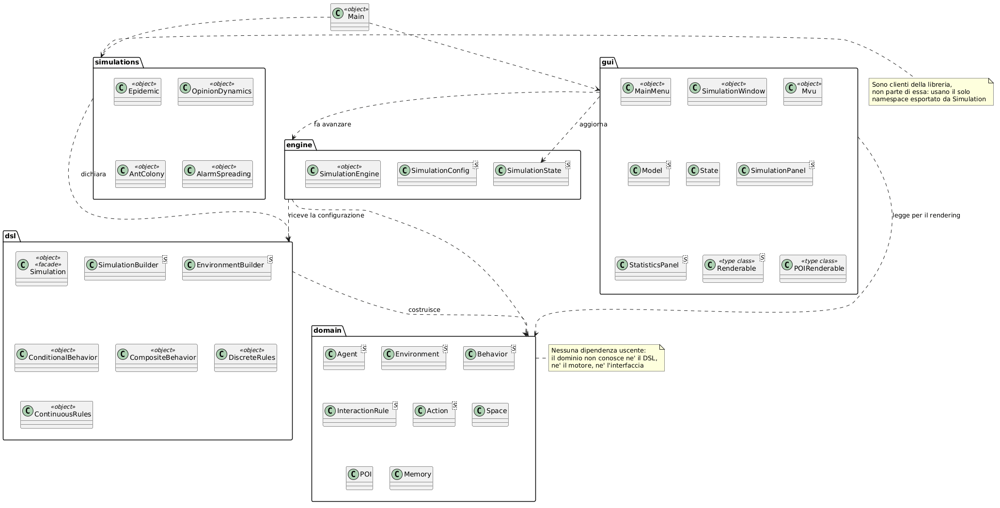
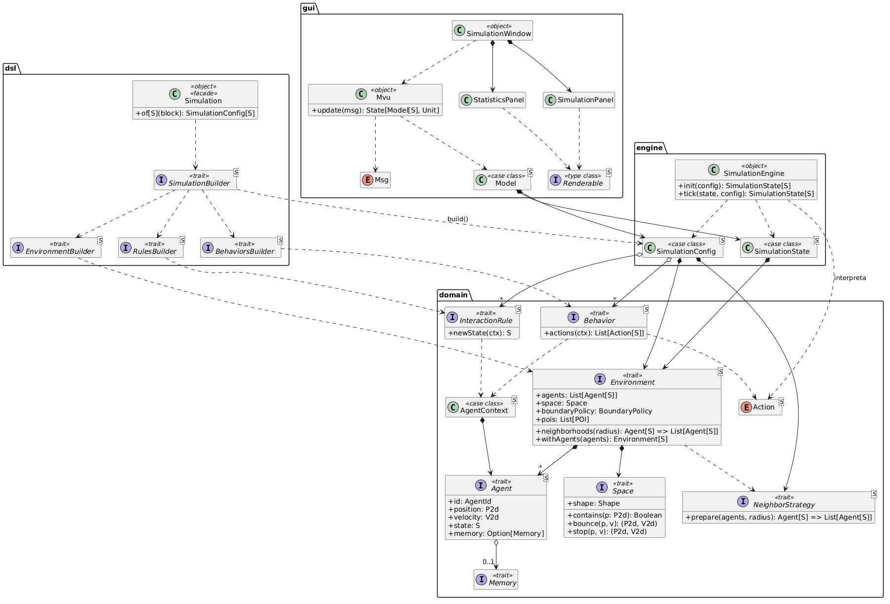
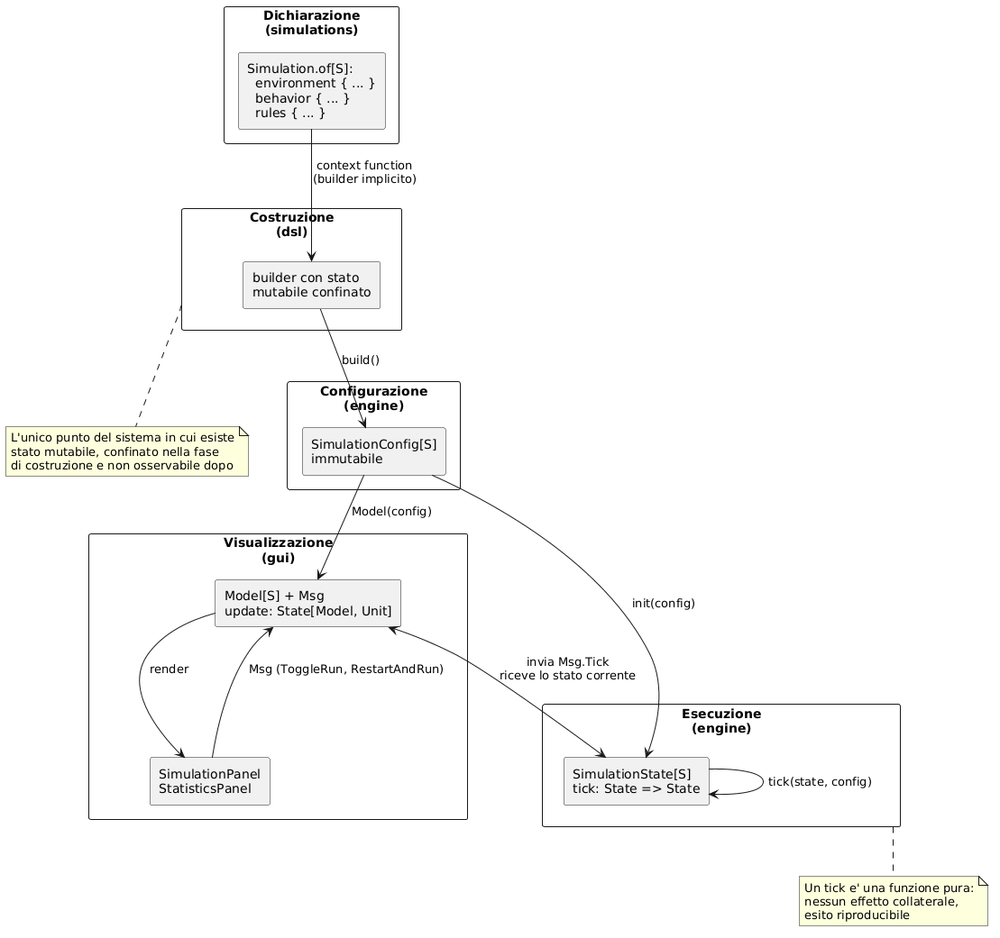

# Design architetturale

Il design architetturale del sistema è stato elaborato a partire dai requisiti funzionali e non funzionali
identificati. L'obiettivo principale è stato creare una struttura modulare, estensibile e riusabile che permettesse di
descrivere in modo dichiarativo una simulazione ad agenti, garantendo una chiara separazione tra il modello del
dominio, il linguaggio con cui l'utente lo descrive, il motore che lo esegue e l'interfaccia che lo visualizza.

## Architettura a livelli

Il sistema non è un'applicazione monolitica ma una **libreria** corredata da alcune applicazioni di esempio. Questa
natura ha suggerito un'architettura a livelli, in cui ogni livello dipende solo da quelli sottostanti e nessuna
dipendenza risale la gerarchia. I livelli individuati sono quattro:

* **Domain**: rappresenta il nucleo concettuale del sistema. Contiene le astrazioni del modello ad agenti — l'agente,
  lo spazio, l'ambiente, il contesto di percezione, le azioni, i comportamenti e le regole di interazione — sotto
  forma di strutture dati immutabili e di trait privi di logica applicativa. È completamente disaccoppiato dagli altri
  livelli: non conosce né il DSL che lo costruisce, né il motore che lo esegue, né l'interfaccia che lo visualizza

* **DSL**: è il linguaggio dichiarativo con cui l'utente descrive una simulazione. Il suo compito è tradurre una
  descrizione leggibile in istanze delle astrazioni del Domain, senza aggiungere alcuna semantica di esecuzione.
  Comprende i builder, il vocabolario di sorgenti di azioni e condizioni, e la facciata `Simulation` che ne unifica
  l'accesso

* **Engine**: è il motore di esecuzione. Riceve una configurazione immutabile prodotta dal DSL e la fa evolvere nel
  tempo, interpretando le azioni dichiarate dagli agenti e producendo a ogni passo un nuovo stato. È l'unico punto del
  sistema in cui un'intenzione diventa una modifica dello stato

* **GUI**: è l'interfaccia grafica, realizzata con Swing e organizzata secondo il pattern Model-View-Update. Osserva lo
  stato prodotto dall'Engine e lo rende visibile, senza contenere alcuna logica di simulazione

A questi si affianca il modulo **simulations**, che non fa parte della libreria ma ne è il primo cliente: contiene le
quattro simulazioni di esempio, scritte esclusivamente attraverso il namespace pubblico esportato dal DSL.

La motivazione principale di questa suddivisione è la **riusabilità**. Poiché il Domain non dipende da nulla, può
essere usato senza il DSL; poiché l'Engine dipende dal solo Domain, una simulazione può essere eseguita senza alcuna
interfaccia grafica, come avviene nei test; e poiché la GUI riceve lo stato come dato, sostituirla con una diversa
tecnologia di rendering non richiede alcuna modifica ai livelli sottostanti.

## Pattern Model-View-Update per l'interfaccia

Per l'interfaccia grafica è stato adottato il pattern **Model-View-Update (MVU)**, i suoi tre elementi sono:

* **Model**: una struttura dati immutabile che descrive per intero ciò che l'interfaccia deve conoscere, ovvero lo
  stato della simulazione, la configurazione da cui è stata generata e l'indicazione se sia in esecuzione o in pausa

* **View**: la funzione che, dato il Model, produce la rappresentazione visiva. Nel nostro caso è realizzata dai
  pannelli Swing, che ridisegnano interamente la scena a partire dall'ultimo Model ricevuto e non conservano alcuno
  stato proprio

* **Update**: la funzione che, dato un messaggio, produce la trasformazione del Model. Ogni interazione dell'utente e
  ogni scadenza del timer sono tradotte in un valore dell'`enum` `Msg`, e l'aggiornamento è espresso come **monade di
  stato**, così che più trasformazioni possano essere composte mantenendo implicito il passaggio del modello

La scelta di MVU al posto di MVC è motivata dal intenzione di adottare un approccio e struttura diversa da quella
classica, MVC, già usata in altri corsi.

I componenti Swing conservano soltanto lo stato locale necessario alla visualizzazione: il `SimulationPanel` mantiene
il modello da ridisegnare, mentre il `StatisticsPanel` mantiene lo storico delle distribuzioni, i dati sulle
transizioni e la griglia di densità.

## Struttura del Progetto

La struttura del progetto è organizzata in quattro moduli principali più un modulo di esempi, che riflettono la
separazione delle responsabilità descritta sopra. Il diagramma evidenzia il vincolo architetturale fondamentale: le
frecce di dipendenza puntano tutte verso il basso, e dal package `domain` non ne esce alcuna.

1. **domain**: definisce le astrazioni del modello ad agenti. `Agent` descrive l'entità simulata con la sua identità
   (`AgentId`), il suo stato di moto (`P2d`, `V2d`), il suo stato di dominio e la sua eventuale `Memory`.
   `Environment` aggrega la popolazione, lo `Space` con la relativa `BoundaryPolicy` e i punti di interesse, ed espone
   il calcolo del vicinato delegandolo a una `NeighborStrategy` intercambiabile. `AgentContext` rappresenta la
   fotografia locale su cui l'agente decide, mentre `Behavior`, `Action` e `InteractionRule` distinguono come un
   agente agisce da come un agente cambia

2. **dsl**: fornisce il linguaggio dichiarativo. I builder (`SimulationBuilder`, `EnvironmentBuilder`,
   `BehaviorsBuilder`, `RulesBuilder`) raccolgono le dichiarazioni scritte all'interno dei rispettivi blocchi tramite
   **context function**, mentre `ConditionalBehavior`, `CompositeBehavior`, `DiscreteRules` e `ContinuousRules`
   costituiscono il vocabolario con cui comportamenti e regole vengono espressi. La facciata `Simulation` ripubblica
   l'intero namespace tramite la clausola `export`, così che l'utente debba conoscere un solo punto di ingresso

3. **engine**: contiene il motore di esecuzione. `SimulationConfig` è il prodotto immutabile del DSL e resta invariata
   per l'intera esecuzione, `SimulationState` è ciò che evolve a ogni passo, e `SimulationEngine` implementa la
   pipeline del tick, articolata in fasi separate di percezione, decisione, evoluzione della popolazione,
   comunicazione e aggiornamento delle permanenze

4. **gui**: contiene l'interfaccia grafica. `MainMenu` è il punto di ingresso e presenta le simulazioni disponibili
   come `SimulationOption`; `SimulationWindow` gestisce il ciclo di vita di una singola simulazione e collega il ciclo
   MVU ai componenti Swing; `SimulationPanel` disegna la scena e `StatisticsPanel` ne mostra l'andamento quantitativo.
   Le type class `Renderable` e `POIRenderable` associano un colore agli stati e ai punti di interesse, evitando che il
   modulo grafico dipenda dal dominio della singola simulazione

5. **simulations**: raccoglie i quattro modelli di esempio (`Epidemic`, `OpinionDynamics`, `AntColony`,
   `AlarmSpreading`). Non fanno parte della libreria ma ne sono i clienti, e ciascuno è stato scelto per esercitare
   una combinazione differente delle funzionalità offerte dal DSL

Il secondo diagramma mostra le principali astrazioni di ciascun modulo e le relazioni che le legano. Sono
riconoscibili i punti di estensione del sistema, tutti realizzati come trait o type class: `Space` e `BoundaryPolicy`
per la geometria del mondo, `NeighborStrategy` per l'algoritmo di ricerca dei vicini, `Behavior` e `InteractionRule`
per la logica degli agenti, `Renderable` per la presentazione. Aggiungere una nuova forma di spazio, una nuova
strategia di vicinato o un nuovo tipo di stato non richiede di modificare alcun codice esistente, in accordo con il
principio Open/Closed.

## Il flusso di una simulazione

Il diagramma illustra il percorso che porta da una descrizione dichiarativa a un'animazione sullo schermo, e rende
esplicita una scelta architetturale ricorrente: la **separazione tra la fase di costruzione e la fase di esecuzione**.

Durante la costruzione, i builder accumulano le dichiarazioni in uno stato mutabile, che è però confinato al loro
interno e non sopravvive alla chiamata a `build()`. Il risultato è una `SimulationConfig` immutabile, che costituisce
il confine tra i due mondi: da quel momento in poi nessuna struttura dati viene più modificata.

Durante l'esecuzione, ogni passo è una funzione pura da `SimulationState` a `SimulationState`. Ne discendono tre
proprietà utili: la simulazione è **riproducibile**, poiché lo stesso stato iniziale produce la stessa evoluzione a
meno delle sole componenti probabilistiche; è **collaudabile** senza alcuna infrastruttura di supporto, poiché
verificare un tick significa confrontare due valori; ed è **riavviabile** in modo elementare, poiché basta rigenerare
lo stato dalla configurazione, che non è mai stata alterata.

## Principi di Programmazione Funzionale

L'intero progetto è stato sviluppato seguendo principi di programmazione funzionale, come richiesto dai requisiti:

* **Immutabilità**: tutte le strutture dati del dominio sono immutabili. Ogni aggiornamento di un agente, di una
  memoria o di un ambiente produce una nuova istanza, e l'unico stato mutabile del sistema è confinato nei builder e
  nei componenti Swing, dove serve rispettivamente ad accumulare la configurazione e a interfacciarsi con una libreria
  imperativa

* **Funzioni pure**: la decisione di un agente e l'avanzamento della simulazione sono funzioni prive di effetti
  collaterali. Un comportamento non muove un agente, ma restituisce l'intenzione di muoverlo sotto forma di valore
  `Action`, che il motore interpreta separatamente. Nel motore non compare alcun ciclo imperativo: nascite e morti,
  recapito dei messaggi, permanenze sui punti di interesse e composizione delle velocità sono tutti accumuli espressi
  con `foldLeft`

* **Higher-order function e composizione**: comportamenti e condizioni sono semplici alias di funzione
  (`ActionSource`, `Condition`), il che rende la composizione gratuita. I combinatori `to`, `orElse`, `onlyIf`, `and`
  e `or` costruiscono comportamenti e predicati complessi a partire da elementi elementari, senza gerarchie di classi.
  Anche la popolazione iniziale è descritta da funzioni (`Int => S` e `Int => P2d`), valutate dal `SimulationBuilder`
  al momento della costruzione

* **Extension method e metodi infix**: le operazioni sono aggiunte ai tipi dall'esterno, senza wrapper e senza
  ereditarietà. È il meccanismo con cui `P2d` e `V2d` espongono l'algebra vettoriale, `Agent` le proprie
  trasformazioni e il DSL le proprie parole chiave: essendo `infix`, `whenAgentIs`, `iff`, `withBoundary` e `withOne`
  si scrivono senza punto né parentesi, e la dichiarazione risultante si legge come una frase

* **Type class**: `Continuous` rende idoneo alle regole continue un qualunque tipo di stato, mentre `Renderable` e
  `POIRenderable` ne definiscono l'aspetto grafico, tutte senza imporre vincoli di ereditarietà al tipo dell'utente.
  `Monad` è astratta su un costruttore di tipo (`Monad[M[_]]`) e riceve la propria istanza da `State`.
  `NeighborStrategy` e `POIRenderable` sono fornite come **given instance** di default, così da restare configurabili
  ma mai obbligatorie

* **Opaque type**: `AgentId`, `PoiId` e `Chance` impediscono di confondere un identificatore o una probabilità con un
  numero qualsiasi, senza introdurre un wrapper a runtime. `Chance` concentra inoltre nel punto di costruzione la
  verifica che il valore appartenga all'intervallo ammesso

* **Context function**: i blocchi del DSL sono funzioni con parametro di contesto (`Builder[S] ?=> Unit`), meccanismo
  che consente alle dichiarazioni annidate di registrarsi presso il builder corretto senza che l'utente debba mai
  nominarlo

* **Monade di stato**: l'aggiornamento dell'interfaccia è espresso come `State[Model[S], Unit]`, permettendo di
  comporre più trasformazioni con `flatMap` e mantenendo funzionale la logica di un componente per sua natura
  imperativo

* **Enum e pattern matching esaustivo**: azioni, messaggi, politiche di frontiera, eventi di memoria e forme dello
  spazio sono insiemi chiusi, il che consente al compilatore di verificare che ogni caso sia gestito e trasforma in
  errori di compilazione quelle che sarebbero altrimenti omissioni silenziose

[Indice](0-index.md) | [Capitolo Precedente](3-analysis.md) | [Capitolo Successivo](5-design.md)