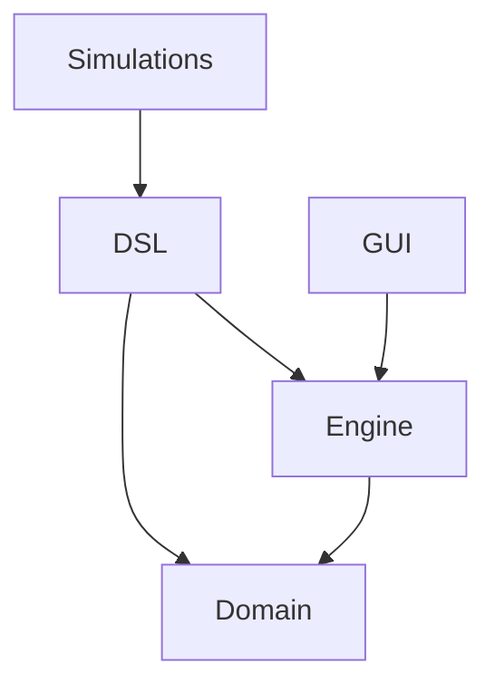

# Design Architetturale

Il design architetturale del sistema è stato elaborato a partire dai requisiti
funzionali e non funzionali identificati nel capitolo precedente. L'obiettivo
principale è stato ottenere una struttura in cui la **specifica** di una
simulazione e la sua **esecuzione** siano concetti separati, e in cui il nucleo
del framework non contenga alcuna conoscenza dei domini simulati.

## Separazione fra specifica ed esecuzione

La scelta architetturale che caratterizza il progetto è la distinzione fra ciò
che descrive un modello e ciò che lo fa avanzare nel tempo.

Un `Behavior` e una `InteractionRule` sono **dati**: espongono il criterio con
cui si applicano — lo stato dell'agente a cui rispondono e, per le regole, la
condizione che deve valere — e la trasformazione da compiere quando quel criterio
è soddisfatto. Non contengono alcuna nozione di quando verranno valutati né di
come le loro conseguenze verranno propagate.

Allo stesso modo, un'`Action` prodotta da un `Behavior` è un dato inerte:
descrive che l'agente *intende* muoversi, ricordare, generare un nuovo agente o
sparire, ma non lo realizza. La sua applicazione compete all'`Engine`.

Ne consegue che l'intero modello è un valore immutabile e ispezionabile, e che
l'unico componente che conosce l'ordine delle operazioni, l'avanzamento del
tempo e la costruzione della popolazione successiva è il motore. Questa
separazione porta tre benefici diretti sui requisiti non funzionali:

- **testabilità**: `Behavior` e `InteractionRule` sono funzioni pure della
  percezione locale e si verificano senza avviare una simulazione;
- **determinismo**: tutti gli agenti osservano lo stesso istante e nessuno
  osserva le conseguenze delle scelte altrui prima del tick successivo;
- **genericità**: il motore manipola il tipo di stato `S` senza mai
  interrogarlo, quindi non contiene conoscenza di dominio.

## Struttura del progetto

Il progetto è organizzato in cinque moduli, con dipendenze rigorosamente
orientate verso il basso: nessun modulo conosce quelli che lo utilizzano.

### Domain

Contiene le astrazioni fondamentali del framework e non dipende da nulla:
`Agent`, `Behavior`, `InteractionRule`, `Environment`, insieme ai concetti che
li supportano — `Action`, `AgentContext`, `Memory`, `POI`, `Space` e le
primitive geometriche `P2d` e `V2d`.

È il vocabolario del sistema: definisce che cosa esiste in una simulazione
agent-based, senza stabilire come venga costruita né come venga eseguita.
Essendo privo di dipendenze, è anche il modulo che resta stabile quando gli
altri cambiano.

### Engine

Contiene il motore di esecuzione e la rappresentazione dello stato di una
simulazione in corso: `SimulationEngine`, `SimulationState` e
`SimulationConfig`.

L'`Engine` è l'unico componente che conosce l'ordine delle operazioni di un
tick. Riceve una configurazione immutabile — ambiente iniziale, comportamenti,
regole, raggio di percezione — e produce, dato uno stato, lo stato successivo.
Non espone alcuna interfaccia di configurazione: la costruzione di una
`SimulationConfig` è compito del modulo `DSL`.

### DSL

Costituisce l'interfaccia principale del framework verso chi scrive
simulazioni. Comprende i *builder* che accumulano la specifica — ambiente,
comportamenti, regole — e il vocabolario di funzioni con cui la specifica viene
espressa: sorgenti di azione come `moveRandomly` o `tellNeighbours`, condizioni
come `atLeastNear` o `inside`, e i costrutti infissi che li legano fra loro.

Il modulo è organizzato per **scope annidati**: ogni blocco del linguaggio
mette a disposizione, tramite un parametro contestuale, il costruttore
dell'oggetto che si sta definendo, e le funzioni scritte all'interno del blocco
vi si registrano. Il risultato è che l'utente vede soltanto i costrutti
pertinenti al punto in cui si trova.

Il `DSL` è un modulo di sola costruzione: il valore che produce è una
`SimulationConfig`, dopodiché non partecipa più all'esecuzione.

### Simulations

Contiene i modelli dimostrativi realizzati sul framework. Ogni simulazione
definisce il proprio tipo di stato, la propria configurazione espressa nel DSL
e il criterio con cui i suoi stati vengono rappresentati graficamente.

Le simulazioni non sono parte del framework: sono i suoi primi utilizzatori, e
il fatto che condividano lo stesso `Engine` pur appartenendo a domini diversi
costituisce la verifica pratica del requisito di genericità.

### GUI

Si occupa della rappresentazione grafica di uno `SimulationState` e del ciclo di
aggiornamento a schermo. Non contiene logica di simulazione: legge la
popolazione corrente e la disegna.

Il collegamento fra lo stato di un agente e il suo aspetto è mediato da una
*type class* `Renderable`, che ogni simulazione fornisce per il proprio tipo di
stato. In questo modo la `GUI` sa disegnare qualunque simulazione senza
conoscerne il dominio, e una simulazione può essere definita e testata anche in
assenza di interfaccia grafica.

## Il ciclo di esecuzione

A ogni tick il motore esegue le stesse fasi, nello stesso ordine.

1. **Percezione** — per ogni agente viene costruito il suo `AgentContext`:
   l'agente stesso, i vicini entro il raggio di percezione, il tick corrente e
   la sua permanenza nei punti di interesse.
2. **Deliberazione** — fra i `Behavior` disponibili viene individuato quello
   applicabile allo stato dell'agente, che produce le azioni; parallelamente
   viene individuata la `InteractionRule` applicabile, che ne determina il nuovo
   stato. Le due selezioni avvengono con lo stesso meccanismo e sono
   indipendenti fra loro.
3. **Applicazione** — le azioni vengono realizzate: gli spostamenti richiesti
   vengono composti e vincolati dalla politica di confine, i ricordi vengono
   registrati, gli agenti generati entrano nella popolazione e quelli eliminati
   ne escono.
4. **Consegna** — i ricordi che un agente ha comunicato ad altri vengono
   recapitati ai rispettivi destinatari.

Le fasi 3 e 4 sono distinte perché rispondono a nature diverse: la prima
riguarda gli effetti che un agente produce su di sé, la seconda quelli che
produce su altri. Tenerle separate consente di aggregare correttamente gli
effetti su un singolo agente — più richieste di movimento nello stesso tick
compongono un unico spostamento — senza per questo rinunciare alla
comunicazione fra agenti.

La percezione è calcolata interamente prima che qualsiasi aggiornamento venga
applicato: è questa la garanzia che l'ordine con cui gli agenti vengono
elaborati non influenzi il risultato.

## Principi di programmazione funzionale

L'architettura applica i principi del paradigma funzionale, come richiesto dai
requisiti.

- **Immutabilità**: `Agent`, `Environment`, `SimulationState` e ogni struttura
  del dominio sono immutabili. Ogni fase del tick produce un nuovo valore invece
  di modificare quello precedente, il che elimina gli effetti collaterali e
  rende ogni stato intermedio ispezionabile.
- **Funzioni pure**: `Behavior` e `InteractionRule` sono funzioni della sola
  percezione locale. Le uniche sorgenti di non determinismo sono quelle
  dichiarate esplicitamente nel modello, come le condizioni probabilistiche.
- **Algebraic Data Type**: `Action` è un tipo somma che enumera gli effetti che
  il motore sa interpretare. La chiusura dell'insieme è deliberata: il
  compilatore verifica l'esaustività del trattamento, e l'aggiunta di un
  effetto è una decisione consapevole sul contratto fra modello e motore.
- **Type class**: la dipendenza del framework da capacità specifiche del tipo di
  stato è espressa tramite *type class* — `Renderable` per la
  rappresentazione grafica, `Continuous` per le regole su stati a valore
  numerico. Questo evita di imporre gerarchie di ereditarietà sui tipi definiti
  dall'utente.
- **Contextual abstraction**: i blocchi del DSL sono *context function*, e i
  costruttori vengono propagati come parametri impliciti. È il meccanismo che
  rende possibile la struttura a scope annidati senza che l'utente debba
  nominare i builder.
- **Opaque type**: gli identificatori e i valori vincolati — `AgentId`, `PoiId`,
  `Chance` — sono tipi opachi su primitivi, così da ottenere sicurezza di tipo
  senza costo a runtime.
- **Composizione**: il vocabolario del DSL è costituito da funzioni combinabili
  fra loro. Un comportamento complesso non richiede un costrutto dedicato, ma si
  ottiene componendo comportamenti elementari.

[Indice](0-index.md) | [Capitolo Precedente](3-analysis.md) | [Capitolo Successivo](5-design.md)