# Design di Dettaglio

## Panoramica

In questa sezione viene approfondito il design delle componenti chiave del progetto, illustrando le principali responsabilità funzionali, le scelte implementative e le interazioni tra i moduli. L'analisi segue la suddivisione in quattro livelli introdotta nel design architetturale: il **Domain**, che modella i concetti di agente, spazio e regola; il **DSL**, che espone la sintassi dichiarativa con cui l'utente descrive una simulazione; l'**Engine**, che esegue il ciclo di aggiornamento; e la **GUI**, che visualizza lo stato secondo il pattern **Model-View-Update (MVU)**.

Trasversalmente a tutti i livelli valgono due scelte di fondo: l'**immutabilità** delle strutture dati di dominio, per cui ogni passo di simulazione produce un nuovo stato senza modificare il precedente, e la **parametricità sullo stato dell'agente** (`S`), che rende il framework indipendente dal dominio applicativo concreto. L'unico stato mutabile presente è confinato nei builder del DSL e nei componenti Swing, dove serve rispettivamente ad accumulare la configurazione e a interfacciarsi con una libreria imperativa.

## Domain

Il Domain racchiude i concetti fondamentali del modello ad agenti. È completamente disaccoppiato dal DSL, dall'Engine e dalla GUI: definisce *cosa* sono un agente, uno spazio, un comportamento e una regola, senza sapere come vengano costruiti né come vengano eseguiti.

### Spazio, Posizione e Spostamento

La posizione è rappresentata dalla `case class` **`P2d`**, mentre il vettore di velocità o spostamento è rappresentato dalla `case class` **`V2d`**. Entrambe sono arricchite tramite **extension methods**: `P2d` supporta la somma con un vettore e la differenza fra due posizioni, che restituisce un `V2d`; `V2d` supporta invece le operazioni algebriche necessarie al movimento, tra cui somma, prodotto per scalare, calcolo della lunghezza e normalizzazione. Questa distinzione impedisce operazioni prive di significato, come la somma fra due posizioni, e mantiene il codice vicino alla notazione matematica senza introdurre gerarchie di tipi.

Lo spazio della simulazione è rappresentato dal trait **`Space`**, che definisce le operazioni geometriche comuni indipendentemente dalla forma concreta del mondo. Lo spazio verifica se una posizione appartiene ai propri confini tramite `contains`, corregge le posizioni non valide tramite `clamp` e fornisce le operazioni `bounce` e `stop` per gestire il movimento in prossimità dei bordi. Queste operazioni non modificano direttamente gli agenti, ma restituiscono nuovi valori di posizione e velocità che vengono successivamente applicati dall'engine durante l'aggiornamento del tick.

Le implementazioni fornite sono `RectangularSpace` e `CircularSpace`. Il primo rappresenta una regione rettangolare definita da larghezza e altezza, mentre il secondo rappresenta una regione circolare definita da centro e raggio. Entrambi gli spazi possono implementare il trait `Toroidal`, che fornisce l'operazione `wrap` per il trasferimento della posizione sul lato opposto dello spazio. La scelta del comportamento ai confini è invece incapsulata nell'enum `BoundaryPolicy`, che distingue fra `bounce`, `stop` e `wrap`.

La forma geometrica è descritta dall'enum `Shape`, utilizzato anche dalla GUI per determinare come disegnare il confine dell'ambiente.

- **Scelte di design**:
  - la distinzione tra posizione e vettore non è soltanto formale, ma semantica: impedisce di sommare due posizioni e rende la differenza tra posizioni un vettore;
  - il trait `Space` astrae la geometria dal resto del modello, così che l'engine possa applicare le operazioni spaziali senza conoscere la forma concreta;
  - `BoundaryPolicy` separa la scelta del comportamento ai confini dalla geometria dello spazio;
  - `Toroidal` rappresenta separatamente la capacità di effettuare il wrap, disponibile soltanto per gli spazi che la supportano;
  - `Shape` costituisce una descrizione chiusa delle forme supportate e consente di utilizzare il pattern matching per gestire separatamente rettangoli e cerchi;
  - le operazioni geometriche restituiscono nuovi valori invece di modificare lo spazio o gli agenti, mantenendo l'immutabilità delle strutture del dominio.

- **Casi degeneri**: la normalizzazione di un `V2d` di lunghezza nulla restituisce il vettore nullo, evitando valori non definiti nelle operazioni del DSL e nelle simulazioni che utilizzano il calcolo delle direzioni.

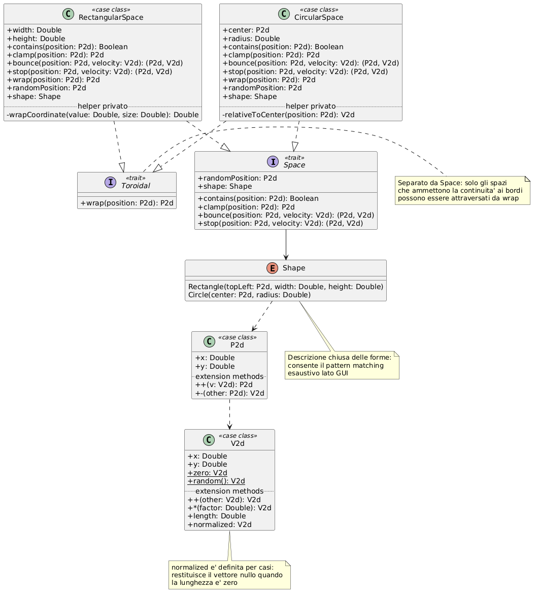

### Agente e Identità

Il trait **`Agent[S]`** rappresenta la singola entità simulata ed è definito come struttura puramente descrittiva: identità, posizione, velocità, stato di dominio e memoria opzionale.

* **Responsabilità**:
    * Aggregare le proprietà osservabili di un'entità, senza contenere logica comportamentale
    * Fornire operazioni di aggiornamento non distruttive tramite extension methods (`withMotion`, `withState`, `withMemory`), ciascuna delle quali restituisce una nuova istanza
    * Esporre in modo sicuro il contenuto della memoria (`remembers`), restituendo una lista vuota quando l'agente non è dotato di memoria
* **Scelte di design**:
    * L'implementazione `AgentImpl` è una `case class` **privata**, accessibile solo attraverso il companion object: il client dipende dall'astrazione e la rappresentazione interna resta libera di evolvere
    * L'identificatore è un **opaque type** `AgentId` su `Int`: garantisce type-safety a costo zero a runtime, impedendo di confondere un identificatore con un qualunque intero
    * La memoria è `Option[Memory]` perché è una capacità opzionale: le simulazioni che non ne hanno bisogno non pagano né in spazio né in complessità

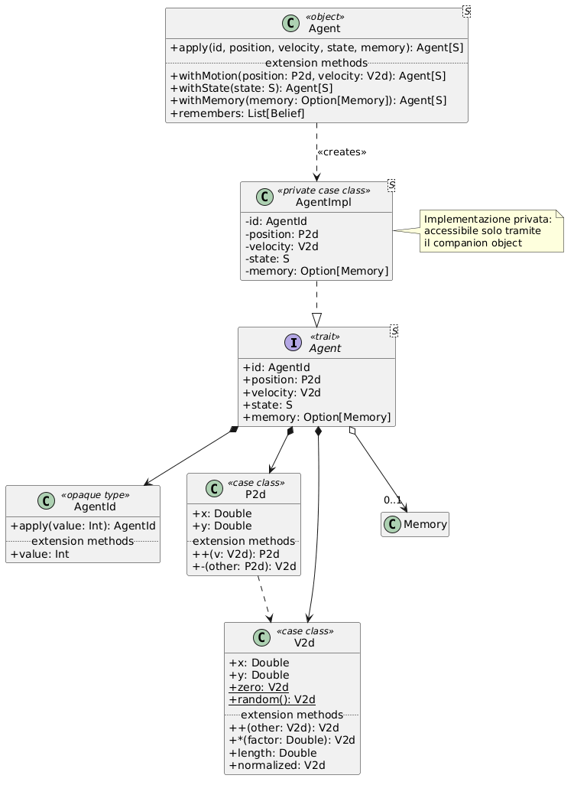

### Contesto di Percezione

La `case class` **`AgentContext[S]`** è la fotografia locale del mondo su cui un agente decide: l'agente in esame, i suoi vicini, il tick corrente e la sua permanenza nei punti di interesse, l'idea di fondo è che gli agenti prendano delle decisioni valutando solo il loro contesto locale e da esse scaturisca un pattern soprastante dato dal interazione con tutti gli altri agenti.

* **Responsabilità**:
    * Costituire l'unico canale attraverso cui comportamenti e regole accedono al mondo, garantendo che la decisione sia una funzione della sola informazione locale
    * Offrire interrogazioni derivate tramite extension methods: filtro dei vicini per distanza (`visibleWithin`), raccolta delle credenze udibili dai vicini (`heardBeliefs`), verifica della presenza in un punto di interesse (`isInside`) e della permanenza prolungata al suo interno (`hasSettledIn`)
* **Scelte di design**: l'alias `type Condition[S] = AgentContext[S] => Boolean` eleva il concetto di condizione a funzione di prima classe, rendendo possibile comporre i predicati del DSL con gli operatori `and` e `or` senza definire una gerarchia di classi dedicata

### Ambiente, Confini e Vicinato

Il trait `Environment` aggrega lo spazio, la popolazione corrente, la politica di frontiera e i
`Point of Interest`. Espone inoltre le operazioni necessarie alla ricerca dei vicini e alla
creazione di nuove versioni dell'ambiente dopo l'aggiornamento della popolazione.

La gestione del movimento in prossimità dei confini è delegata a `BoundaryPolicy`, un enum che
distingue tre comportamenti: `bounce`, che riflette il movimento dell'agente, `stop`, che lo
arresta, e `wrap`, che trasferisce l'agente sul lato opposto dello spazio quando la geometria
lo consente. Se `wrap` viene applicato a uno spazio che non implementa `Toroidal`, viene
utilizzato il comportamento di rimbalzo.

La ricerca dei vicini è astratta dal trait **`NeighborStrategy`**, che espone le operazioni
`prepare` e `neighborsOf`. L'object `NeighborStrategy` fornisce le implementazioni
`bruteForce` e `grid`, oltre a una `given defaultStrategy` utilizzata quando non viene fornita
una strategia esplicita. La strategia `bruteForce` confronta ogni agente con tutti gli altri,
mentre `grid` costruisce un indice spaziale e limita i confronti agli agenti presenti nelle
celle pertinenti.

- **Scelte di design**:
  - `Environment` aggrega spazio, agenti, politica dei confini e `POI`, mantenendo separata la
    descrizione dell'ambiente dalla logica delle simulazioni;
  - `BoundaryPolicy` separa la scelta del comportamento al confine dalla geometria concreta
    dello spazio;
  - `NeighborStrategy` astrae l'algoritmo di ricerca dei vicini e permette di scegliere tra
    l'implementazione `bruteForce` e quella indicizzata `grid`;
  - l'object `NeighborStrategy` fornisce una strategia predefinita, mantenendo comunque la
    possibilità di configurare esplicitamente l'algoritmo;
  - `withAgents` e `withPois` restituiscono nuove versioni dell'ambiente senza modificarne
    l'istanza originale.
  
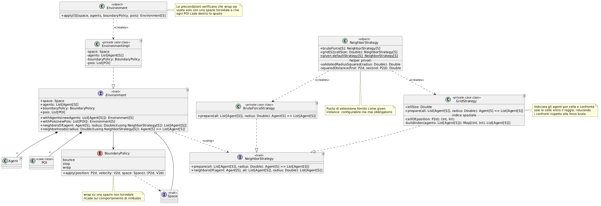

### Point of Interest

Il `Point of Interest` è modellato dalla `case class` **`POI`** e rappresenta una regione circolare dotata di posizione, raggio e nome. Non è un agente e non possiede un comportamento autonomo: costituisce invece un elemento dell'ambiente che può essere osservato dagli agenti e utilizzato come condizione dalle regole di interazione.

La verifica di appartenenza è effettuata confrontando la distanza tra la posizione dell'agente e il centro del punto con il relativo raggio. L'Engine aggiorna a ogni tick la mappa delle permanenze, incrementando il conteggio quando l'agente rimane all'interno del POI e azzerandolo quando ne esce. La condizione `settledIn` utilizza queste informazioni per verificare se è stato raggiunto l'`activationDelay` previsto dal punto di interesse e distinguere così la sosta effettiva dal semplice attraversamento.

- **Scelte di design**:
  - il `POI` è mantenuto indipendente dalla logica degli agenti e dalla rappresentazione grafica. La sua presenza nel dominio consente al DSL di esprimere condizioni spaziali e temporali senza introdurre comportamenti specializzati nell'Engine.
  - `PoiId` è definito come opaque type, evitando di confondere l'identificatore di un `POI`
       con un intero generico senza introdurre costi a runtime.

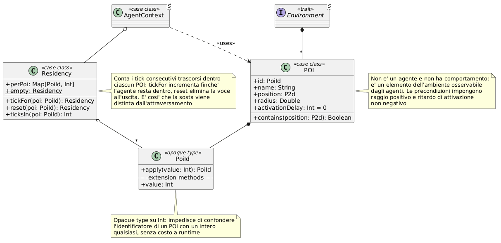

### Memoria e Credenze

La memoria dell'agente è modellata dal trait **`Memory`**, che conserva una lista di **`Belief`**, ciascuno costituito da un evento e dal tick in cui è stato registrato.

* **Responsabilità**:
    * Registrare un nuovo evento (`remember`) restituendo una nuova memoria
    * Applicare un limite di capacità, mantenendo solo le credenze più recenti
    * Esporre interrogazioni di uso comune: l'ultima credenza (`latest`) e le sole osservazioni di punti di interesse (`sightings`)
* **Tipi di evento**: l'`enum` **`MemoryEvent`** distingue l'osservazione diretta (`Sighting`, che trasporta identificatore e posizione del punto di interesse) dall'incontro con un altro agente (`Encounter`), lasciando la struttura aperta a ulteriori casi
* **Scelte di design**: la capacità limitata combinata con le condizioni temporali del DSL (`recentlySighted`, `nothingSightedIn`), consente di esprimere fenomeni come la propagazione e il progressivo esaurimento di un allarme

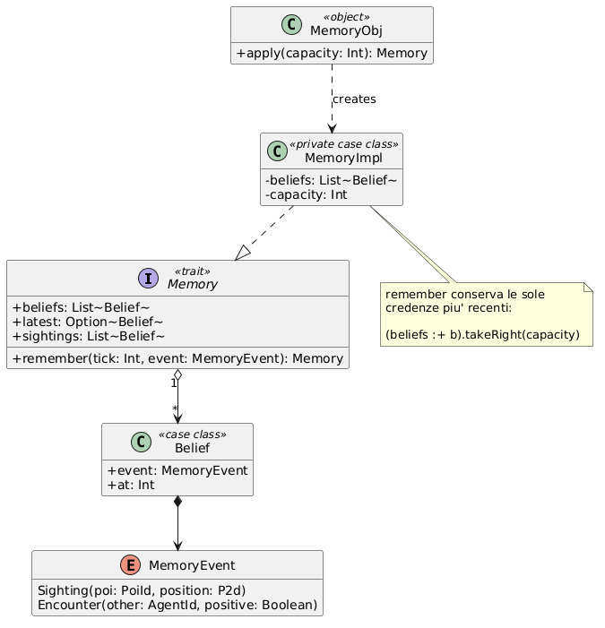

### Azioni e Comportamenti

L'`enum` **`Action[S]`** definisce l'insieme chiuso delle azioni che un agente può intraprendere: spostarsi (`Move`), registrare un evento nella propria memoria (`Remember`), comunicarlo a un destinatario (`Tell`), generare un nuovo agente (`Spawn`) e cessare di esistere (`Die`).

* **Responsabilità**: costituire il vocabolario dell'intenzione. Un'azione è un **dato**, non un effetto: viene prodotta dal comportamento e interpretata dall'Engine, che è l'unico punto in cui l'intenzione diventa modifica dello stato
* **Vantaggi**: la decisione resta una funzione pura e facilmente collaudabile, ed è possibile ispezionare le intenzioni prima di applicarle, come avviene per la risoluzione della morte e delle nascite

Il trait **`Behavior[S]`** associa a un eventuale stato di attivazione la funzione che produce la lista di azioni.

* **Responsabilità**:
    * Dichiarare lo stato per cui il comportamento è pertinente (`whenState`) e produrre le azioni dato il contesto (`actions`)
    * Determinare la propria applicabilità (`appliesTo`): un comportamento privo di stato di attivazione è il comportamento di default e si applica a ogni agente
* **Scelte di design**: il metodo `appliesTo` ha un'implementazione di default nel trait, così che le implementazioni concrete debbano fornire la sola logica specifica

### Regole di Interazione

Il trait **`InteractionRule[S]`** governa l'evoluzione dello stato di dominio, separandola nettamente dal comportamento.

* **Responsabilità**:
    * Dichiarare lo stato di partenza (`whenState`) e la condizione contestuale (`context`) che ne abilitano l'applicazione
    * Calcolare il nuovo stato dell'agente a partire dal contesto (`newState`)
* **Scelte di design**: la distinzione tra `Behavior` e `InteractionRule` riflette la distinzione tra *come un agente agisce* e *come un agente cambia*. Un agente infetto si muove più velocemente perché lo dice un comportamento, ma guarisce perché lo dice una regola; le due dimensioni possono essere modificate indipendentemente

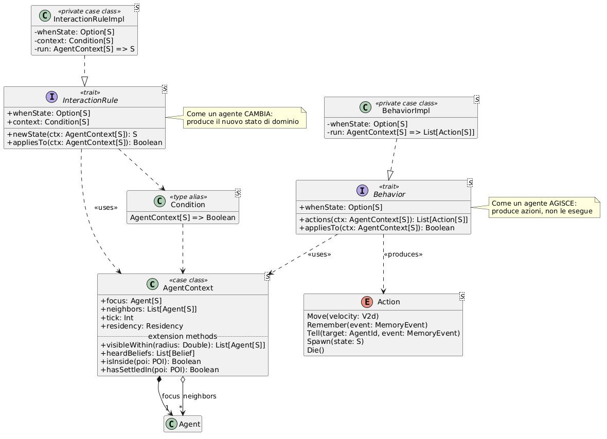

## DSL

Il DSL è il livello con cui l'utente del framework descrive una simulazione. L'obiettivo di design è che una simulazione sia leggibile come un documento dichiarativo, in cui la struttura del testo coincide con la struttura del modello.

### Struttura a Builder e Context Function

La costruzione avviene tramite quattro builder cooperanti — `SimulationBuilder`, `EnvironmentBuilder`, `BehaviorsBuilder` e `RulesBuilder` — attivati dai blocchi `environment`, `behavior` e `rules`.

* **Responsabilità**:
    * `EnvironmentBuilder`: raccogliere la configurazione dell'ambiente e della popolazione iniziale e materializzarla, tramite `build()`, in un `EnvironmentSpec` completo
    * `BehaviorsBuilder` e `RulesBuilder`: accumulare rispettivamente i comportamenti e le regole dichiarati all'interno del proprio blocco
    * `SimulationBuilder`: aggregare le tre parti e materializzarle nella `SimulationConfig` finale, istanziando la popolazione iniziale a partire dalle funzioni generatrici
* **Meccanismo**: ogni blocco è una **context function** (`Builder[S] ?=> Unit`). Il builder viene creato dal blocco stesso e reso disponibile come parametro `using` a tutte le costruzioni annidate, che possono quindi registrarsi senza mai essere nominate esplicitamente dall'utente. È questo il meccanismo che consente di scrivere `Dead whenAgentIs Infected iff chanceOf(mortalityChance)` come istruzione autonoma, e allo stesso modo le operazioni esposte dall'object `EnvironmentBuilder` utilizzano il builder implicito associato al blocco `environment`
* **Scelte di design**:
    * Lo stato mutabile è **confinato** nelle implementazioni private dei builder e non sopravvive alla costruzione: l'esito è una `SimulationConfig` immutabile
    * `BehaviorsBuilder` ordina i comportamenti raccolti in modo che quello di default risulti sempre ultimo, rendendo l'esito indipendente dall'ordine in cui l'utente li ha scritti
    * Le configurazioni incomplete o incoerenti sono intercettate in fase di costruzione tramite precondizioni e messaggi espliciti

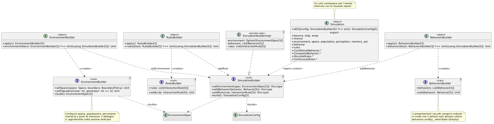

### Configurazione dell'Ambiente

L'object **`EnvironmentBuilder`** fornisce il vocabolario del blocco `environment`, ovvero la parte del DSL con cui l'utente dichiara la forma del mondo e la popolazione che lo abita.

* **Costruzioni disponibili**: la scelta dello spazio e della politica di frontiera (`space`, `withBoundary`), il raggio di percezione degli agenti (`perception`), la numerosità della popolazione e la funzione che ne determina lo stato (`population`, `of`, `eachBeing`, `withOne`), la funzione che ne determina la posizione iniziale (`placedAt`), la capacità opzionale della memoria (`memory`) e i `Point of Interest` presenti nell'ambiente (`poi`)
* **Configurazioni intermedie**: `space` e `population` non restituiscono `Unit` ma rispettivamente uno `SpaceConfig` e un `PopulationConfig`, che espongono i propri affinamenti come metodi `infix` incatenabili. È questo il meccanismo che permette di scrivere la configurazione dello spazio e quella della popolazione come singole istruzioni leggibili, mantenendo comunque un unico builder a raccoglierle
* **Differenziazione della popolazione**: `withOne` compone il generatore corrente con uno nuovo, così che un individuo possa distinguersi dal resto della popolazione senza che l'utente debba scrivere esplicitamente la funzione che discrimina in base all'indice
* **Scelte di design**:
    * Lo stato mutabile è confinato nell'implementazione privata `EnvironmentBuilderImpl`: il client non costruisce direttamente l'ambiente, ma dichiara le funzioni necessarie alla sua inizializzazione
    * L'esito della costruzione non è un `Environment` ma un `EnvironmentSpec`, una descrizione ancora priva di agenti: è il `SimulationBuilder` a trasformarla nell'ambiente e nella popolazione iniziali, mantenendo la creazione degli identificatori in un unico punto
    * `build()` verifica la presenza dello spazio e della popolazione e controlla che la numerosità sia positiva, mentre le validazioni sulla coerenza fra politica di frontiera, spazio e `Point of Interest` restano a carico della costruzione dell'`Environment`
    * Le impostazioni non dichiarate hanno un valore di riposo: il rimbalzo come politica di frontiera e il posizionamento casuale nello spazio, così che una configurazione minimale resti comunque eseguibile

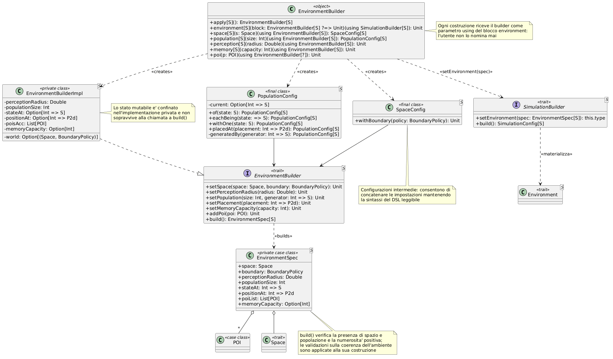

### Comportamenti Condizionali

L'object **`ConditionalBehavior`** introduce il tipo `ActionSource[S]`, alias per `AgentContext[S] => List[Action[S]]`, e su di esso costruisce un'algebra di composizione.

* **Sorgenti di base**: movimento casuale (`moveRandomly`), orizzontale (`moveHorizontally`), verso o lontano da un punto (`moveTowards`, `moveAwayFrom`) o da una posizione ricordata (`moveTowardsRemembered`, `moveAwayFromRemembered`), arresto (`stopMoving`), osservazione dei punti di interesse (`rememberSightings`), comunicazione (`tellNeighbours`, `learnFromNeighbours`), riproduzione (`spawn`) e morte (`die`)
* **Combinatori**, definiti come extension methods `infix`:
    * `to`: concatena due sorgenti, unendone le azioni
    * `orElse`: applica la seconda sorgente solo se la prima non produce azioni, realizzando un fallback
    * `onlyIf`: subordina l'esecuzione a una condizione sul contesto
    * `vanishingWith`: aggiunge la morte dell'agente con una data probabilità
    * `whenAgentIs`: registra la sorgente come comportamento associato a uno stato, mentre `asDefault` la registra come comportamento generale
* **Scelte di design**: modellare la sorgente di azioni come semplice alias di funzione, anziché come trait, rende gratuita la composizione e consente all'utente di definire sorgenti personalizzate come normali funzioni, ottenendo automaticamente tutti i combinatori

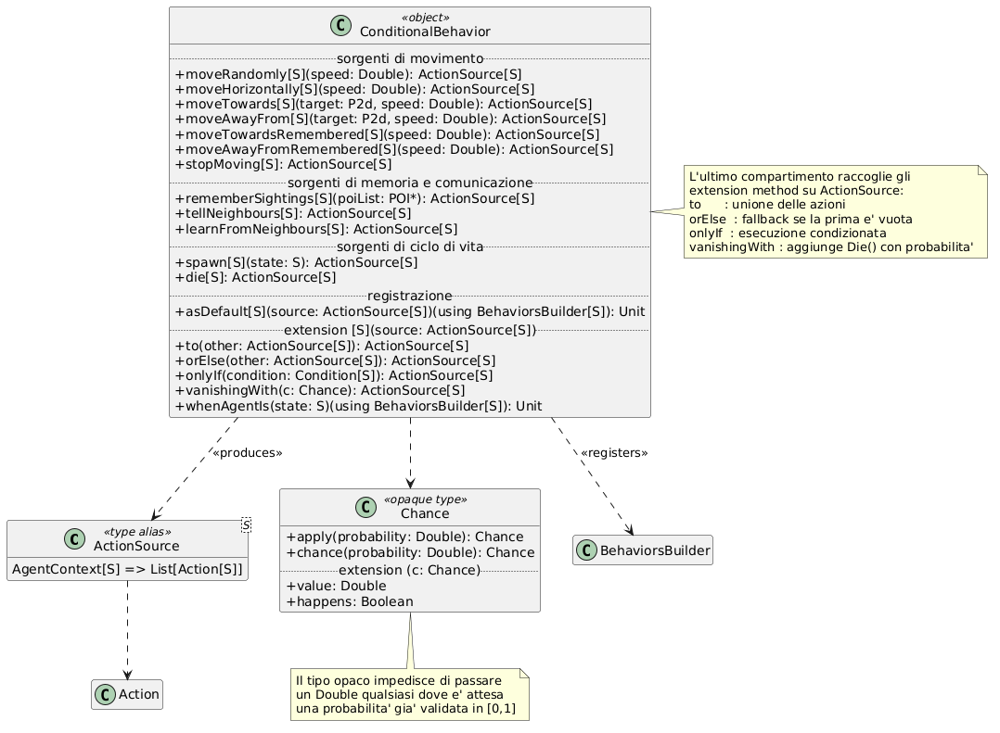

### Comportamenti Compositi

L'object **`CompositeBehavior`** implementa il comportamento di stormo, in cui la direzione di un agente nasce dalla somma pesata di più contributi.

* **Responsabilità**: calcolare le componenti di **coesione** verso il baricentro dei simili, **allineamento** alla loro velocità media, **separazione** dagli agenti troppo vicini o da evitare, e **mantenimento della direzione** corrente, combinandole in un'unica azione di movimento
* **Configurazione**: la classe `FlockConfig` espone i parametri come metodi `infix` incatenabili (`avoid`, `movingAt`, `keepingApart`, `withCohesion`, `withAlignment`, `withSeparation`, `withHeading`), ciascuno dotato di un valore di default sensato
* **Scelte di design**:
    * L'appartenenza allo stormo non è determinata dall'identità di stato ma da un **predicato binario** sugli stati, il che permette di formare gruppi per similarità e non solo per uguaglianza
    * `FlockConfig` estende `ActionSource`, quindi lo stormo è una sorgente di azioni come tutte le altre e può essere combinato con i medesimi operatori
    * Una funzione ausiliaria di normalizzazione con fallback protegge dai vettori nulli, evitando che un agente privo di stimoli resti immobile

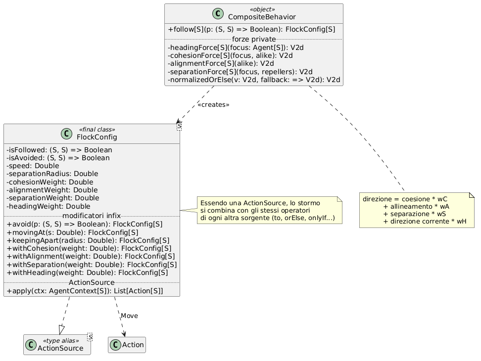

### Regole Discrete

L'object **`DiscreteRules`** fornisce la sintassi per le transizioni di stato e il vocabolario di condizioni su cui si fondano.

* **Sintassi**: la forma `NuovoStato whenAgentIs StatoPrecedente iff condizione` è ottenuta in due passi. Un extension method su un valore di stato produce una `Transition`, che rappresenta la coppia stato di partenza/stato di arrivo; un secondo extension method sulla transizione accetta la condizione e registra la regola risultante presso il `RulesBuilder` implicito
* **Condizioni disponibili**: conteggio dei vicini in un dato stato (`atLeastNear`, `exactlyNear`, `fewerNear`), probabilità (`chanceOf`), relazione con i punti di interesse (`inside`, `settledIn`), distanza da un punto (`farFrom`) e condizioni sulla memoria (`recentlySighted`, `nothingSightedIn`)
* **Composizione**: gli operatori `infix` `and` e `or` combinano le condizioni preservandone il tipo, così che una condizione composta resti utilizzabile ovunque lo sia una condizione semplice
* **Scelte di design**: `Transition` è un trait pubblico con implementazione privata, ma la sua costruzione è riservata all'interno del modulo: l'utente lo incontra solo come passaggio intermedio della sintassi, mai come tipo da nominare

### Regole Continue

L'object **`ContinuousRules`** affronta il caso in cui lo stato non sia un insieme finito di casi ma una grandezza numerica.

* **Meccanismo**: il trait **`Continuous[S]`** è una **type class** che estrae un valore numerico dallo stato e vi reinserisce un valore aggiornato. Definendone una given instance, un qualunque tipo di stato diventa idoneo alle regole continue
* **Regola fornita**: `convergeTowardsAverage` sposta il valore dell'agente verso la media dei vicini influenti, con parametri per il raggio di influenza, il criterio di affinità e il tasso di convergenza, tutti dotati di valori di default
* **Scelte di design**: l'uso di una type class anziché di un vincolo di ereditarietà mantiene il tipo di stato dell'utente completamente libero: `Opinion` resta una normale `case class`, e l'adattamento al framework è esterno e non invasivo

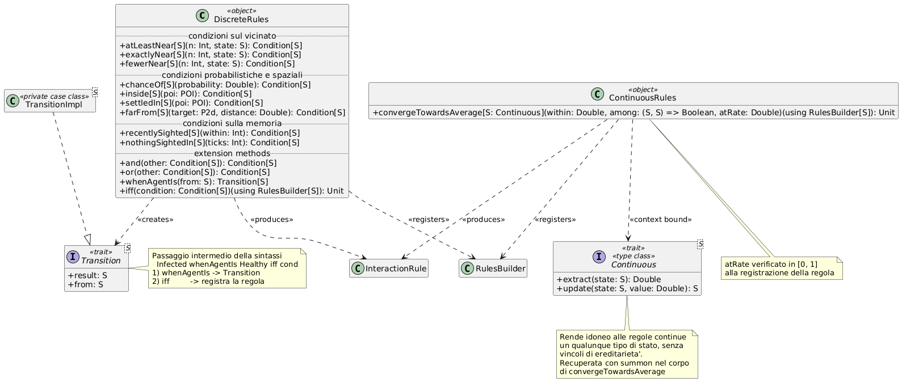

### Probabilità e Facciata

L'**opaque type `Chance`** incapsula una probabilità, validandone l'appartenenza all'intervallo unitario alla costruzione ed esponendo l'estrazione tramite `happens`. Il tipo opaco impedisce di passare un `Double` qualsiasi dove è attesa una probabilità.

L'object **`Simulation`** è la facciata del DSL: tramite la clausola **`export`** ripubblica in un unico punto tutte le costruzioni dei moduli sottostanti, così che l'utente debba importare un solo namespace. Il metodo `of` apre il blocco di configurazione e restituisce la `SimulationConfig` risultante.

## Engine

L'Engine è il livello che trasforma una configurazione dichiarativa in un'evoluzione temporale. È realizzato come object senza stato: l'intero stato della simulazione è trasportato dal valore `SimulationState`.

### Stato e Configurazione

* **`SimulationConfig[S]`**: aggrega ambiente iniziale, comportamenti, raggio di percezione, regole e strategia di vicinato. È il prodotto del DSL e l'input dell'Engine, che la riceve come valore immutabile senza conoscerne il processo di costruzione
* **`SimulationState[S]`**: contiene l'ambiente corrente, il tick, il prossimo identificatore disponibile e la mappa delle permanenze nei punti di interesse, esponendo l'accesso sicuro a queste ultime tramite `residencyOf`
* **Scelte di design**: separare configurazione e stato distingue ciò che è fisso per l'intera simulazione da ciò che evolve, e rende il riavvio un'operazione elementare, ottenuta rigenerando lo stato dalla configurazione immutata

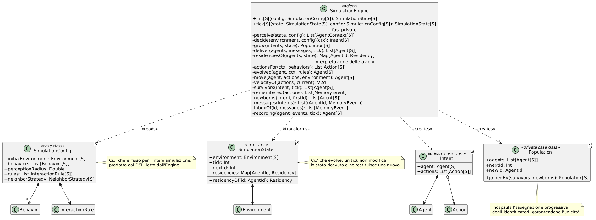

### Pipeline del Tick

Il metodo `tick` è il cuore del sistema e organizza l'aggiornamento in fasi successive, ciascuna affidata a una funzione privata dedicata.

* **Percezione (`perceive`)**: prepara **una sola volta** la funzione di ricerca dei vicini tramite la strategia configurata, e costruisce per ogni agente il proprio `AgentContext`, completo di vicini, tick e permanenze
* **Decisione (`decide`)**: seleziona il **primo** comportamento applicabile e ne raccoglie le azioni, applica lo spostamento risultante e infine la **prima** regola applicabile per aggiornare lo stato di dominio. Il risultato è un `Intent`, struttura privata che accoppia l'agente aggiornato alle azioni che ha dichiarato
* **Evoluzione della popolazione (`grow`)**: attraversa gli intenti accumulando i sopravvissuti e i nuovi nati in una struttura `Population`, che incapsula anche l'assegnazione progressiva degli identificatori garantendone l'unicità
* **Comunicazione (`deliver`)**: estrae dalle azioni tutti i messaggi diretti e li recapita ai rispettivi destinatari, registrandoli nella loro memoria
* **Permanenze (`residenciesOf`)**: per ogni agente e per ogni punto di interesse, incrementa il contatore di permanenza se l'agente si trova all'interno, azzerandolo altrimenti. È questo meccanismo a rendere esprimibile la condizione `settledIn`, che distingue il transito occasionale dalla sosta effettiva
* **Scelte di design**:
    * La scelta del **primo** comportamento e della **prima** regola applicabili rende l'esito deterministico e attribuisce all'ordine di dichiarazione il significato di priorità, coerentemente con l'ordinamento operato dal `BehaviorsBuilder`
    * Le fasi sono nettamente separate: tutti gli agenti percepiscono lo stato del tick precedente prima che qualunque aggiornamento sia applicato, evitando che l'ordine di elaborazione influenzi il risultato
    * L'intero tick è una funzione pura da stato a stato, il che rende la simulazione riproducibile e collaudabile senza alcuna infrastruttura di supporto

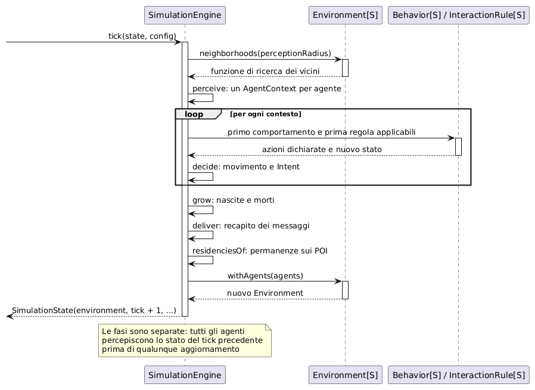

### Interpretazione delle Azioni

L'Engine è l'unico interprete del vocabolario definito da `Action`.

* **`Move`**: le velocità dichiarate vengono sommate; in assenza di azioni di movimento viene conservata la velocità corrente. La posizione risultante è poi filtrata dalla politica di frontiera dell'ambiente, che restituisce la coppia posizione/velocità definitiva
* **`Remember`**: l'evento è registrato nella memoria dell'agente con il tick corrente, senza effetto se l'agente non è dotato di memoria
* **`Tell`**: il messaggio è raccolto e recapitato nella fase di comunicazione, in modo che un agente possa ricevere informazioni anche da agenti elaborati dopo di lui nello stesso tick
* **`Spawn`**: genera nuovi agenti nella posizione del genitore, con identificatori progressivi e direzione iniziale casuale
* **`Die`**: la presenza dell'azione esclude l'agente dalla popolazione del tick successivo; poiché la verifica precede l'applicazione delle altre azioni, la morte prevale su qualunque altro effetto dichiarato nello stesso tick

## GUI

La GUI costituisce il livello responsabile dell'osservazione e del controllo delle simulazioni. È realizzata con Swing e mantiene separata la rappresentazione grafica dalla logica di aggiornamento del modello.

### Ciclo Model-View-Update

L'implementazione del pattern Model-View-Update è distribuita tra `Model`, `Msg`, `Mvu`, `State` e i componenti Swing. `Model` è una struttura dati immutabile che contiene la configurazione, lo stato corrente della simulazione e l'indicazione se l'esecuzione è attiva.

L'enum **`Msg`** rappresenta gli eventi gestiti dalla GUI: avanzamento di un tick, cambio dello stato di esecuzione e riavvio della simulazione. `Mvu.update` traduce 
ciascun messaggio in una trasformazione `State[Model[S], Unit]`. La trasformazione viene applicata dalla `SimulationWindow` tramite il metodo `dispatch`, che
rappresenta l'unico punto in cui il modello viene sostituito. Successivamente `refresh` aggiorna
i componenti grafici sulla base del nuovo modello.

La `case class` **`State[S, A]`** rappresenta una computazione che riceve uno stato di tipo `S`
e restituisce uno stato aggiornato insieme a un valore risultato di tipo `A`. L'object `State`
fornisce una data instance della type class **`Monad`** per questo costruttore di tipo. La
`Monad` espone le operazioni `unit`, `map` e `flatMap`, permettendo di comporre trasformazioni
successive senza gestire esplicitamente il passaggio del modello.

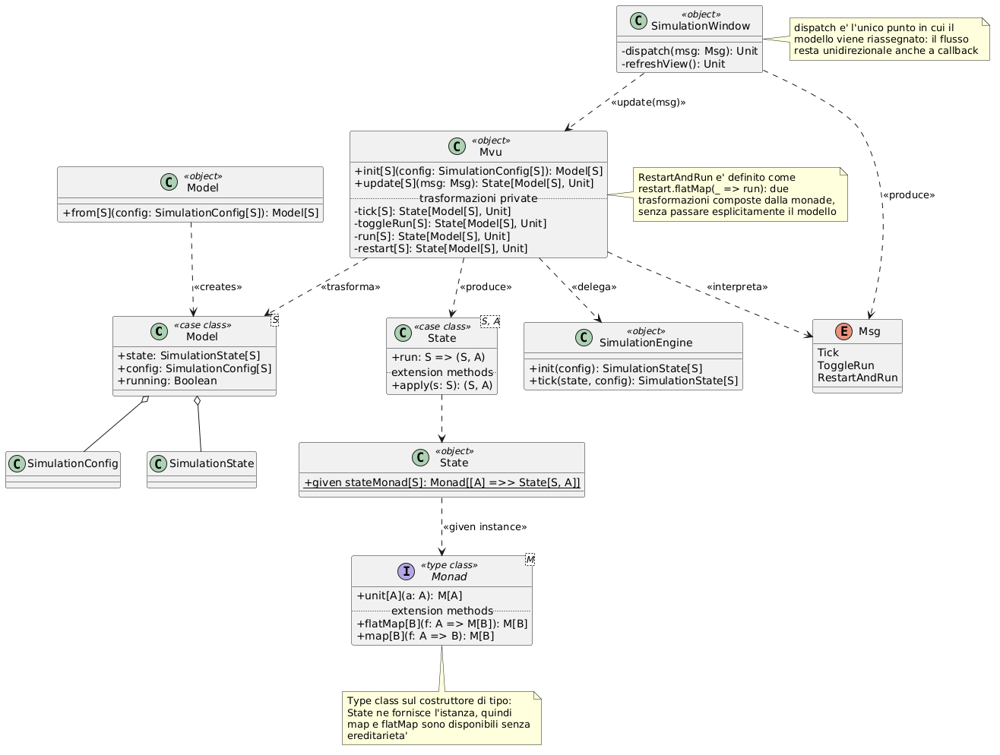

### Menu e Finestra di Simulazione

Il **`MainMenu`** rappresenta il punto di ingresso dell'applicazione e presenta le simulazioni
disponibili attraverso oggetti `SimulationOption`. La selezione di un'opzione nasconde il menu
e apre la finestra della simulazione; alla chiusura della finestra, una callback permette di
tornare al menu principale.

La **`SimulationWindow`** coordina i componenti Swing e il ciclo di aggiornamento della
simulazione. Contiene i pulsanti per interrompere o riprendere l'esecuzione e per riavviare la
simulazione. Un timer a intervallo fisso genera periodicamente il messaggio `Tick`, mentre i
pulsanti producono i messaggi `ToggleRun` e `RestartAndRun`.

I messaggi vengono inviati a `Mvu.update`, che restituisce una trasformazione
`State[Model[S], Unit]`. La trasformazione viene applicata al modello corrente e, al termine,
`SimulationWindow.dispatch` riassegna il nuovo modello e aggiorna `SimulationPanel` e
`StatisticsPanel`.

- **Scelte di design**: la funzione `dispatch` è l'unico punto in cui il modello viene
  riassegnato. Timer e pulsanti si limitano a produrre messaggi, per cui il flusso resta
  unidirezionale anche in un contesto basato su callback.

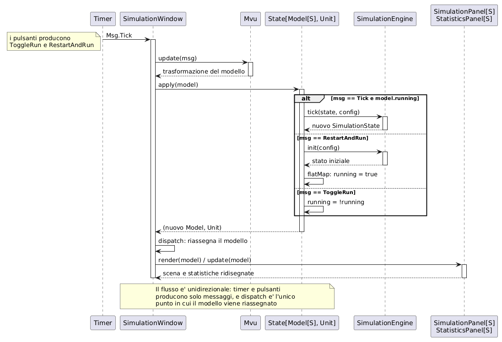

### Rendering

Il **`SimulationPanel`** visualizza la scena simulata. Disegna il confine dello spazio in forma rettangolare o circolare, i `Point of Interest` e gli agenti presenti nell'ambiente. Il colore degli agenti è determinato dalla type class `Renderable[S]`, mentre quello dei punti di interesse da `POIRenderable`. In questo modo la libreria non deve conoscere il significato concreto degli stati della simulazione.

* **Responsabilità**:
    * Ricavare le dimensioni dell'area di disegno dalla `Shape` dello spazio e centrare il mondo nell'area disponibile mediante una traslazione del contesto grafico
    * Ridisegnare interamente la scena a ogni aggiornamento, senza conservare stato proprio oltre all'ultimo modello ricevuto
* **Scelte di design**: l'uso di type class per la presentazione è il complemento della parametricità sul tipo di stato. Il framework non conosce i colori di alcun dominio applicativo; è la simulazione a dichiararli, e il compilatore a verificare che tale dichiarazione esista

### Statistiche

Lo **`StatisticsPanel`** affianca alla scena una rappresentazione quantitativa dell'evoluzione, aggiornata a ogni tick insieme al rendering.

* **Indicatori mostrati**:
    * tick corrente e numerosità della popolazione;
    * numero complessivo di cambi di stato osservati dall'inizio della simulazione;
    * numero di agenti presenti in ciascun `Point of Interest`;
    * andamento nel tempo della composizione percentuale della popolazione per stato, sotto forma di grafico a linee con legenda;
    * distribuzione spaziale degli agenti, rappresentata come griglia di celle colorate in base alla percentuale di popolazione contenuta.
* **Logica**:
    * la storia delle composizioni è mantenuta in una lista limitata agli ultimi tick, così che il costo del grafico non cresca con la durata della simulazione;
    * i cambi di stato sono rilevati confrontando l'etichetta corrente di ciascun agente con quella registrata al tick precedente, e non richiedono quindi alcuna collaborazione da parte dell'Engine;
    * la griglia di densità è ricostruita a ogni aggiornamento ripartendo le posizioni degli agenti nelle celle con un solo attraversamento della popolazione.
* **Scelte di design**:
    * le etichette usate nel grafico provengono dalla stessa type class `Renderable` che determina i colori, così che rappresentazione e statistiche restino coerenti;
    * la raccolta delle statistiche può essere sospesa indipendentemente dalla simulazione, il che consente di osservare l'evoluzione senza aggiornare i grafici;
    * il pannello osserva il modello e non lo modifica: non ha alcun canale verso l'Engine e la sua rimozione non altera il comportamento della simulazione

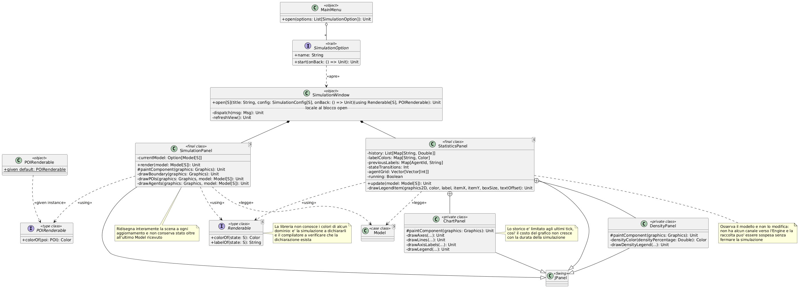

## Simulazioni di Esempio

Le quattro simulazioni incluse sono state usate per validare l'espressività del DSL: ciascuna è stata scelta per esercitare una diversa combinazione di funzionalità.

* **Epidemic**: modello a stati discreti su spazio rettangolare. Esercita le transizioni probabilistiche, le condizioni sul vicinato, la differenziazione del movimento per stato e la scomparsa graduale degli agenti
* **Opinion Dynamics**: modello a stato continuo su spazio circolare toroidale. Esercita la type class `Continuous`, la regola di convergenza verso la media e il comportamento di stormo con affinità basata su un predicato anziché sull'uguaglianza
* **Ant Colony**: esercita i punti di interesse con ritardo di attivazione, la memoria con capacità limitata, la comunicazione tra agenti e la composizione di sorgenti di azioni con fallback, in cui la ricerca casuale interviene solo in assenza di ricordi utili
* **Alarm Spreading**: esercita la propagazione dell'informazione e il suo esaurimento, combinando le condizioni temporali sulla memoria, il posizionamento iniziale personalizzato e la fuga da un punto di interesse

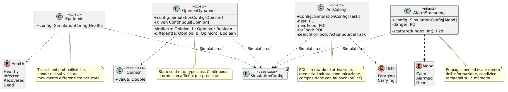

[Indice](0-index.md) | [Capitolo Precedente](4-architecture.md) | [Capitolo Successivo](6-implementation.md)