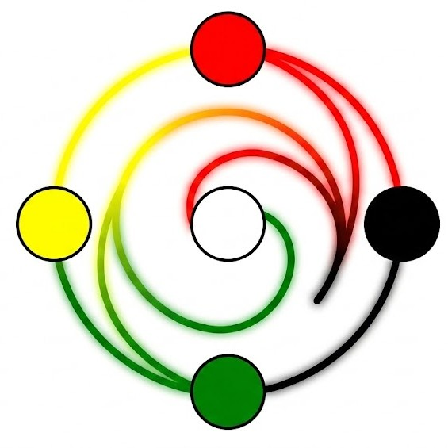

  

<h1 align="center">ABMScala</h1>

  Framework in Scala 3 per simulazioni agent-based, con un DSL dichiarativo per
  configurare ambiente, comportamenti e regole di interazione. 
  Progetto per il corso di Paradigmi di Programmazione e Sviluppo.

  <a href="0-index.html" style="display:inline-block;padding:10px 24px;margin:4px;border-radius:6px;background:#5c4ee5;color:#ffffff;text-decoration:none;font-weight:600;">Documentazione</a>
  <a href="https://github.com/alessiobifulco/PPS-25-ABMScala" style="display:inline-block;padding:10px 24px;margin:4px;border-radius:6px;border:1px solid #d0d7de;color:#5c4ee5;text-decoration:none;font-weight:600;">Repository GitHub</a>

